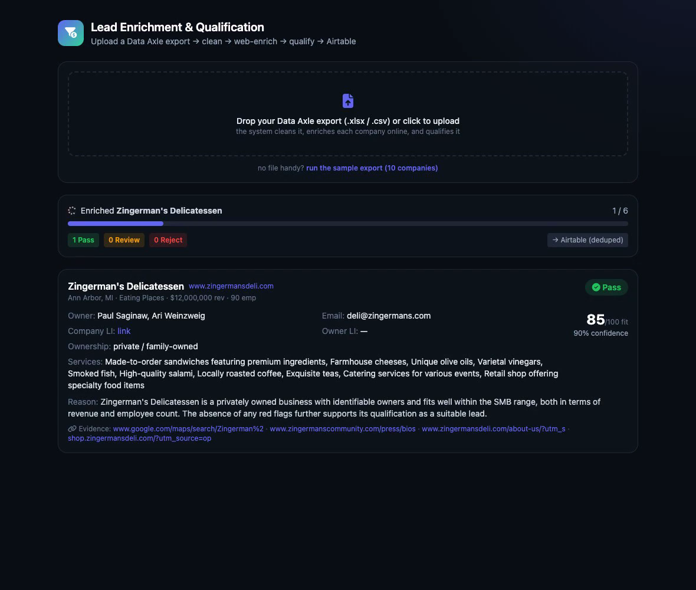

# Lead Enrichment & Qualification

Turn a raw **Data Axle / ReferenceUSA** export into **enriched, qualified, evidence-backed leads** — and push the good ones to **Airtable**, deduped.

**▶️ Live demo:** https://lead-enrichment-hazel.vercel.app — **upload a Data Axle export** and watch each company get enriched + qualified live, or click **"run the sample export."**




## Pipeline

```
raw Data Axle CSV/XLSX
        │
  1. CLEAN      keep the ~14 useful fields, drop the 25+ junk columns, coerce types
        │
  2. ENRICH     live web search per company → website, owner/CEO, email, LinkedIn,
        │       services, private/family signals, public/franchise/PE red flags
        │       — with SOURCE URLs (real citations, not model-invented)
        │
  3. QUALIFY    Pass / Needs Review / Reject + fit score, confidence, reasons,
        │       missing data, evidence URLs  (prefers "Needs Review" over guessing)
        │
  4. AIRTABLE   upsert (dedupe by record_id): Pass/Needs Review → main table,
                Reject → rejected log
```

**Accuracy over volume:** red flags are grounded (public/franchise from the source data, PE-backed only with explicit evidence), emails/LinkedIn are never fabricated, and anything uncertain becomes **Needs Review** with the missing fields listed.

## Sample run (10 companies)

| Company | Result | Why |
|---|---|---|
| Zingerman's Delicatessen | **Pass** | private/family-owned, owner found |
| Gachina Landscape | **Pass** | private SMB, identifiable owner |
| Bornquist Inc | **Pass** | private HVAC, owner found |
| Sweetgreen Inc | **Reject** | publicly traded |
| Tropical Smoothie Cafe | **Reject** | franchise + PE-backed |
| Patagonia Inc | **Reject** | enterprise scale ($1.5B) |
| Riverbend Machine, Hometown HVAC | **Needs Review** | no owner/contact found |
| McKinney Trailer Rentals | **Needs Review** | revenue at high end of range |
| Bob's Red Mill | **Needs Review** | employee-owned (ESOP) — ambiguous |

## Run it

```bash
python3.12 -m venv .venv && source .venv/bin/activate
pip install -r requirements.txt
cp .env.example .env      # add OPENAI_API_KEY
python run.py                          # runs on data/sample_leads.csv
python run.py data/sample_leads.xlsx   # …or the Excel sample (auto-detected)
uvicorn app.main:app --port 8010   # view results at http://localhost:8010
```

**Airtable:** set `AIRTABLE_TOKEN` + `AIRTABLE_BASE_ID` in `.env` to write to a real base (tables `Leads` + `Rejected`, upsert-deduped by `record_id`). Without them it writes the identical records to local JSON so the pipeline runs with zero setup.

## Stack
Python · OpenAI (web search + structured extraction) · pandas · FastAPI · Airtable API (pyairtable). Orchestration is a clean batch job; the enrichment and pricing sources sit behind swappable interfaces (n8n / Perplexity / Browserbase all drop in).

## Structure
```
app/
  clean.py     Data Axle export → standardized leads
  enrich.py    live web search → structured enrichment + evidence URLs
  qualify.py   Pass / Needs Review / Reject + scores + reasons
  airtable.py  upsert + dedupe (real Airtable or local mock)
  pipeline.py  enrich → qualify per lead
  main.py      FastAPI results UI
run.py         batch CLI over a CSV/XLSX
data/sample_leads.csv   messy Data Axle-style sample
```
